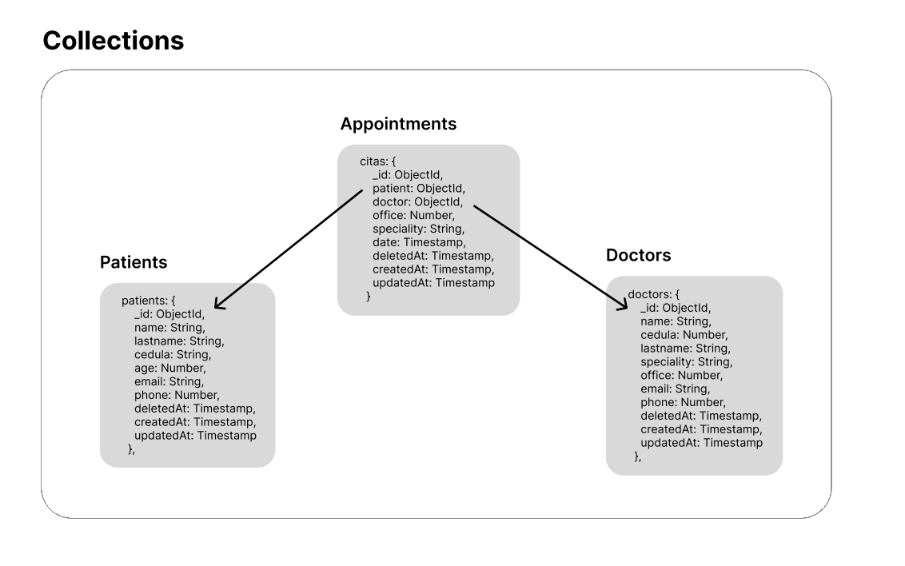

# EPS REST-API
Hi, mi name is **Deibyd** and this is my project to manage patients, doctors and appointments of an EPS.
## Prerequisite
You have to install these tools
- [NodeJS](https://nodejs.org/en)
- [Git](https://git-scm.com/)

## Features and Functionalities
- Get a list of the appointments, patients and doctors in the database and their information
- Create new appointments, patients and doctors in a NoSQL database

## Tech Stack
- [MongoDB - Cloud](https://www.mongodb.com/products/platform/cloud)
- [Express](https://expressjs.com/)
- [NextJS (React)](https://nextjs.org/)
- [NodeJS](https://nodejs.org/en)
- [TypeScript](https://www.typescriptlang.org/)

## Data model

## Installation and running

**1. Clone this repo by running the following commands**

`git clone https://github.com/DeibydBarragan/eps-rest-api.git`

`cd eps-rest-api`

**2. Go to the server folder and install the dependencies**

`cd server`

`npm install`

**3. Create a .env file and add there the following**

```
PORT=8000
MONGO_URI=*YOUR MONGODB DATABASE URI*
```
You can change the port but don't use **3000** because that port is used by the client app

**4. Exit the folder and run the following command**

`npm run dev`

now you can test the API with Postman or another client on this url http://localhost:8000/api

**5. Then, in another terminal go to the root folder and run the followind**

`cd client`

`npm install`

**6. Add a .env.local file with the following**

`NEXT_PUBLIC_API_URL=http://localhost:8000/api`

If you changed the PORT in the server, you also have to change it here like this:

`NEXT_PUBLIC_API_URL=http://localhost:*YOUR PORT*/api`

**7. Now run the following command**

`npm run dev`

Then go to http://localhost:3000 and use the client app

## Build and run backend API with Docker
To execute the backend app in a docker container:

1. Make sure you have docker installed on your system
2. Open the **server** root directory in the terminal
3. Execute the following command

   ```shell
   docker build -t eps-rest-api .

4. Then run the following command:
   ```shell
   docker run --env-file=./.env -p 8000:8000 eps-rest-api:latest .
  
  Now you can use the api from http://localhost:8000/api

## Build and run frontend API with Docker
To execute the frontend app in a docker container:

1. Make sure you have docker installed on your system
2. Open the **client** root directory in the terminal
3. Execute the following command

   ```shell
   docker build -t eps-client-api .

4. Then run the following command:
   ```shell
   docker run --env-file=./.env.local -p 3000:3000 eps-client-api:latest .
  
  Now you can use the frontend app from http://localhost:3000

## How to use the backend API?
### Patients API
#### Create a patient
**Endpoint:** `POST /api/patients`
##### Body example
```json
{
  "name": "Deibyd Santiago",
  "lastname": "Barragán Gaitán",
  "cedula": 1069445930,
  "age": 19,
  "email": "deibydbarragan@hotmail.com",
  "phone": 3134828849
}
```
##### Example
{video}

#### Update a patient
**Endpoint:** `PATCH /api/patients/{id}`
##### Params
- `id` (required): patient id.
##### Body
Use the fields to create patient that you need to update

##### Example
{video}

#### Delete a patient
**Endpoint:** `DELETE /api/patients/{id}`
##### Params
- `id` (required): patient id.

##### Example
{video}

#### Get and paginate patients
**Endpoint:** `GET /api/patients`
##### Query params
- `limit` (optional): limit the number of patients in every page.
- `page` (optional): bring patients of an specific page.

##### Example
{video}

### Doctors API

#### Create a doctor
**Endpoint:** `POST /api/doctors`
##### Body example
```json
{
  "name": "Pablo",
  "lastname": "Casas Mejía",
  "cedula": 221345443,
  "speciality": "Cardiología",
  "office": 205,
  "email": "pablomejia@hotmail.com",
  "phone": 3134828849
}
```
##### Example
{video}

#### Update a doctor
**Endpoint:** `PATCH /api/doctors/{id}`
##### Params
- `id` (required): doctor id.
##### Body
Use the fields to create patient that you need to update

##### Example
{video}

#### Delete a doctor
**Endpoint:** `DELETE /api/patients/{id}`
##### Params
- `id` (required): patient id.

##### Example
{video}

#### Get all doctors without pagination and filter them by speciality
**Endpoint:** `GET /api/allDoctors`
##### Query params
- `speciality` (optional): value must between 0 and 7. Filter doctors by their speciality.

##### Example
{video}

#### Get and paginate doctors
**Endpoint:** `GET /api/doctors`
##### Query params
- `limit` (optional): limit the number of doctors in every page.
- `page` (optional): bring doctors of an specific page.

##### Example
{video}

### Appointments API
#### Create an appointment
**Endpoint:** `POST /api/appointments`
##### Body example
```json
{
    "patientId": "64aa33e1f62c59d341c5bee1",
    "doctorId": "64aa3c1218cd49789c2e0f00",
    "date": "2023-10-18",
    "hour": "08:30"
}
```
- `date` (required): It must be a date in 'YYYY-MM-DD' format.
- `hour` (required): It must be an hour in 'HH:mm' format, 24H format and 30 minutes format.

##### Example
{video}

#### Update an appointment
**Endpoint:** `PATCH /api/appointments/{id}`
##### Params
- `id` (required): appointment id.
##### Body
Use the fields to create patient that you need to update

##### Example
{video}

#### Delete an appointment
**Endpoint:** `DELETE /api/appointments/{id}`
##### Params
- `id` (required): appointment id.

##### Example
{video}

#### Get appointments by patient's cedula
**Endpoint:** `GET /api/appointments/patient/{id}`
##### Params
- `id` (required): patient id.

##### Example
{video}

#### Get appointments by doctor's cedula
**Endpoint:** `GET /api/appointments/doctor/{id}`
##### Params
- `id` (required): doctor id.

##### Example
{video}

#### Get and paginate appointments
**Endpoint:** `GET /api/appointments`
##### Query params
- `speciality` (optional): Get appointments by speciality.

##### Example
{video}

## How to use the frontend API?
### For patients
{video}

### For doctors
[Patients](https://github.com/DeibydBarragan/eps-rest-api/assets/116578796/ae03d297-2679-414b-896f-837cf3665512)

### For appointments
[](https://github.com/DeibydBarragan/eps-rest-api/assets/116578796/263db8f0-1419-4df7-8f37-ec61af52446e
)

## Additionally this project uses:
### For Backend
- [Mongoose](https://mongoosejs.com/)
- [Nodemon](https://nodemon.io/)
- [Express validator](https://express-validator.github.io/docs/)
- [Cors](https://www.npmjs.com/package/cors)
- [Dotenv](https://www.npmjs.com/package/dotenv)
- [Momentjs](https://momentjs.com/)
- [Eslint](https://eslint.org/)
### For frontend
- [NextUI](https://nextui.org/)
- [React Hook Form](https://react-hook-form.com/)
- [React Toastify](https://fkhadra.github.io/react-toastify/introduction/)
- [Yup](https://www.npmjs.com/package/yup)
- [Lucide React](https://lucide.dev/guide/packages/lucide-react)
- [Momentjs](https://momentjs.com/)
- [ESlint](https://eslint.org/)


